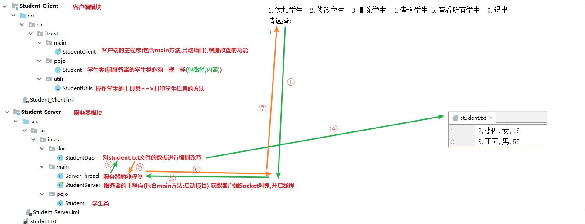
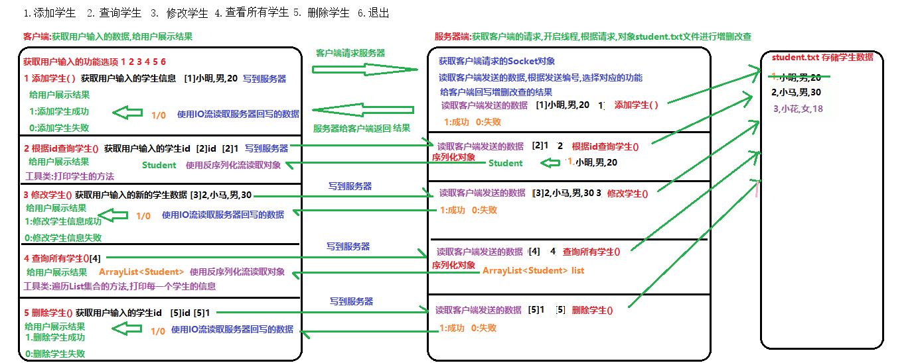
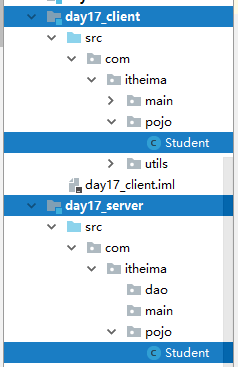

## 一 项目演示

把模块复制到idea中,分别启动服务器端和客户端



## 二 项目说明

### 1 所采用的知识点

​	 本系统采用了我们学过的以下几个核心知识点：

​		1). IO流技术

​				服务器端读写本地的文件,我们采用IO流

​				要求一个学生对象一行数据,并且学生的属性之间使用","隔开

​				1,小明,男,20

​				2,小张,男,20

​		2). 网络编程技术

​				客户端和服务器采用"**短连接**"

​				每个功能当需要连接完服务器之后,断开连接,执行下一个功能在重写连接服务器

​				每个功能都连接一次服务器

​		3). 序列化

​				客户端根据id查询学生信息,服务器端读取文件,查询学生,给客户端返回一个Student对象

​				客户端使用反序列化流读取Student对象

​				客户端查询所有学生信息,服务器读取文件,把查询到的多个Student对象封装到一个ArrayList集合中

​				客户端使用反序列化流读取ArrayList集合对象

```java
1,小名,男,20  Student s = new Student("小名","男",20);
2,小张,男,20  Student s = new Student("小名","男",20);
服务器端:
ArrayList<Student> list = new ArrayList<Student> ();
OutputStream os = socket.getOutputStream();
ObjectOutputStream oos = new ObjectOutputStream(os);
oos.writeObject(list); //服务器给客户端写多个学生信息
oos.writeObject(s); // 服务器给客户端写会一个学生信息
---------------------------------------------------
客户端:
InputStream is = socket.getInputStream();
ObjectInputStream ois = new ObjectInputStream(is);
ArrayList<Student> list = (ArrayList<Student>)ois.readObject();//客户端读取服务器写的集合对象
Student s = (Student)ois.readObject();//客户端读取服务器写的学生对象
```

​		4). 多线程

​				支持多个客户端,同时连接服务器

​				服务器每获取一个客户端对象,都开启一个线程,对客户端对象进行增删改查

### 2 业务交互模式图示



​	【说明】

​		1).客户端和服务器端采用TCP连接；

​		2).数据保存在服务器端；

​		3). 客户端增删改查发送数据格式说明：

​			a). 添加："[1]数据"，例如："[1]张三,男,22"，意思：没有id字段，由服务器端在写入数据前自动添加。

​			b).根据id查询一条数据："[2]id"，例如："[2]1"，意思：查询id为1的学员信息

​			c). 修改一条数据："[3]新数据"。例如："[3]1,张三2,女,19"，意思：将id=1的学员改为后面的新数据。

​			d). 查询所有数据："[4]"。例如："[4]"，意思：后面不用带任何数据。

​			e). 删除一条数据："[5]id"。例如："[5]1"，意思：删除id为1的记录。

## 三 案例代码

### 一.客户端

### 1.创建实体类Student类

~~~java
package com.itheima.pojo;

import java.io.Serializable;

//学生类:实现序列化接口
public class Student implements Serializable{
    //添加一个序列号,防止序列号冲突异常
    private static final long serialVersionUID = 10L;
    //学生id
    private int id;
    //姓名
    private String name;
    //性别
    private String sex;
    //年龄
    private int age;

    public Student() {
    }

    public Student(int id, String name, String sex, int age) {
        this.id = id;
        this.name = name;
        this.sex = sex;
        this.age = age;
    }

    public int getId() {
        return id;
    }

    public void setId(int id) {
        this.id = id;
    }

    public String getName() {
        return name;
    }

    public void setName(String name) {
        this.name = name;
    }

    public String getSex() {
        return sex;
    }

    public void setSex(String sex) {
        this.sex = sex;
    }

    public int getAge() {
        return age;
    }

    public void setAge(int age) {
        this.age = age;
    }
}
~~~

### 2.创建操作学生的工具类

```java
package com.itheima.utils;

import com.itheima.pojo.Student;

import java.io.IOException;
import java.net.Socket;
import java.util.ArrayList;

/*
    创建操作学生的工具类:里边的方法都是静态的
 */
public class StudentUtils {
    //定义一个打印学生对象的方法
    public static void printStudent(Student s){
        System.out.println("-------------------------------------------------");
        System.out.println("编号\t\t姓名\t\t性别\t\t年龄");
        System.out.println(s.getId()+"\t\t"+s.getName()+"\t\t"+s.getSex()+"\t\t"+s.getAge());
        System.out.println("-------------------------------------------------");
    }

    //定义一个打印ArrayList集合中所有学生对象的方法
    public static void printArrayList(ArrayList<Student> list){
        System.out.println("-------------------------------------------------");
        System.out.println("编号\t\t姓名\t\t性别\t\t年龄");
        //遍历集合,获取每一个学生对象
        for (Student s : list) {
            System.out.println(s.getId()+"\t\t"+s.getName()+"\t\t"+s.getSex()+"\t\t"+s.getAge());
        }
        System.out.println("-------------------------------------------------");
    }

    //定义一个根据服务器ip地址和端口号,获取客户端Socket对象的方法
    public static Socket getSocket(){
        Socket socket = null;
        try {
            socket = new Socket("127.0.0.1",8888);
        } catch (IOException e) {
            e.printStackTrace();
        }
        return socket;
    }
}
```

### 3.创建主类StudentClient类

```java
package com.itheima.main;

import java.util.Scanner;

/*
    客户端的主程序:包含main==>启动客户端
    1.定义一个静态的成员Scanner对象,供所有的方法使用
    2.定义一个死循环,让功能重复执行
    3.打印主菜单
    4.获取用户输入的功能选项
    5.根据用户输入的功能选项,选择对应的功能(调用增删改查的方法)
 */
public class StudentClient {
    //1.定义一个静态的成员Scanner对象,供所有的方法使用
    public static Scanner sc = new Scanner(System.in);

    //包含main==>启动客户端
    public static void main(String[] args) {
        //2.定义一个死循环,让功能重复执行
        while (true){
            //3.打印主菜单
            System.out.println("-----------------------------欢迎使用学生管理系统----------------------------");
            System.out.println("1.添加学生  2.根据id查询学生  3.修改学生  4.查看所有学生 5.删除学生  6.退出");
            //4.获取用户输入的功能选项
            System.out.println("请选择您要执行的功能:");
            int choose = sc.nextInt();
            //5.根据用户输入的功能选项,选择对应的功能(调用增删改查的方法)
            switch (choose){
                case 1:
                    //1.添加学生
                    addStudent();
                    break;
                case 2:
                    //2.根据id查询学生
                    findStudentById();
                    break;
                case 3:
                    //3.修改学生
                    updateStudent();
                    break;
                case 4:
                    //4.查看所有学生
                    findAllStudent();
                    break;
                case 5:
                    //5.删除学生
                    deleteStudent();
                    break;
                case 6:
                    //6.退出
                    System.out.println("欢迎您下次继续使用本系统!");
                    System.exit(0);//终止JVM
                default:
                    //输入的不是123456
                    System.out.println("您输入的功能选型不存在,请重新输入!");
                    break;
            }
        }
    }

    /*
        删除学生的方法
     */
    private static void deleteStudent() {

    }

    /*
        查看所有学生的方法
     */
    private static void findAllStudent() {

    }

    /*
        修改学生的方法
     */
    private static void updateStudent() {
    }

    /*
        根据id查询学生的方法
     */
    private static void findStudentById() {

    }

    /*
        添加学生的方法
     */
    private static void addStudent() {
    }
}

```

### 4.添加学生功能

```java
/*
    添加学生的方法
    1.获取用户输入的学生信息(姓名,性别,年龄)
    2.获取客户端Socket对象,连接服务器
    3.客户端往服务器发送数据==>添加==>"[1]张三,男,18"
    4.读取服务器回写的数据==>约定(1:成功,0:失败)
    5.给用户展示结果
    6.释放资源
 */
private static void addStudent() {
    System.out.println("-------------------------您选择的是添加学生的功能,请输入学生信息------------------------");
    //1.获取用户输入的学生信息(姓名,性别,年龄)
    System.out.println("请输入学生的姓名:");
    String name = sc.next();
    System.out.println("请输入学生的性别:");
    String sex = sc.next();
    System.out.println("请输入学生的年龄:");
    int age = sc.nextInt();
    //2.获取客户端Socket对象,连接服务器
    Socket socket = StudentUtils.getSocket();
    //判断获取的客户端对象是否为null
    if(socket==null){
        System.out.println("服务器暂时无法连接,请稍后尝试...");
        return;//结束添加学生的方法
    }
    try{
        //3.客户端往服务器发送数据==>添加==>"[1]张三,男,18"
        OutputStream os = socket.getOutputStream();
        os.write(("[1]"+name+","+sex+","+age).getBytes());

        //4.读取服务器回写的数据==>约定(1:成功,0:失败)
        InputStream is = socket.getInputStream();
        int len = is.read();

        //5.给用户展示结果
        if(len==1){
            System.out.println("[恭喜您,学生添加成功!]");
        }else{
            System.out.println("[添加学生失败,请联系管理员!]");
        }
        //6.释放资源
        socket.close();
    } catch (IOException e) {
        e.printStackTrace();
    }
}
```

### 5.根据id查询学生

```java
/*
    根据id查询学生的方法
    1.获取用户输入的数据(学生id)
    2.获取客户端Socket对象,连接服务器
    3.客户端往服务器发送数据==>根据id查询==>"[2]id"
    4.读取服务器回写的数据==>服务器回写一个Student对象,使用反序列流读取对象
    5.给用户展示结果
    6.释放资源
 */
private static void findStudentById() {
    System.out.println("-------------------------您选择的是根据id查询学生的功能------------------------");
    //1.获取用户输入的数据(学生id)
    System.out.println("请输入您要查询的学生的id:");
    int id = sc.nextInt();
    //2.获取客户端Socket对象,连接服务器
    Socket socket = StudentUtils.getSocket();
    if(socket==null){
        System.out.println("服务器暂时无法连接,请稍后尝试...");
        return;//结束根据id查询学生的方法
    }
    try {
        //3.客户端往服务器发送数据==>根据id查询==>"[2]id"
        OutputStream os = socket.getOutputStream();
        os.write(("[2]"+id).getBytes());

        //4.读取服务器回写的数据==>服务器回写一个Student对象,使用反序列流读取对象
        InputStream is = socket.getInputStream();
        ObjectInputStream ois = new ObjectInputStream(is);
        Student student = (Student)ois.readObject();

        //5.给用户展示结果
        if(student==null){
            //没有查询到对应id的学生
            System.out.println("[查无此人!]");
        }else{
            //调用工具类中打印学生对象的方法
            StudentUtils.printStudent(student);
        }

        //6.释放资源
        ois.close();
        socket.close();
    } catch (IOException e) {
        e.printStackTrace();
    } catch (ClassNotFoundException e) {
        e.printStackTrace();
    }
}
```

### 6.查询所有学生

```java
/*
    查看所有学生的方法
    1.获取用户输入的数据==>查询所有,不用条件
    2.获取客户端Socket对象,连接服务器
    3.客户端往服务器发送数据==>查看所有==>"[4]"
    4.读取服务器回写的数据==>服务器回写一个ArrayList<Student>集合对象,使用反序列流读取对象
    5.给用户展示结果
    6.释放资源
 */
private static void findAllStudent() {
    System.out.println("-------------------------您选择的是查看所有学生的功能------------------------");
    //1.获取用户输入的数据==>查询所有,不用条件
    //2.获取客户端Socket对象,连接服务器
    Socket socket = StudentUtils.getSocket();
    if(socket==null){
        System.out.println("服务器暂时无法连接,请稍后尝试...");
        return;//结束查询所有学生的方法
    }
    try {
        //3.客户端往服务器发送数据==>查看所有==>"[4]"
        OutputStream os = socket.getOutputStream();
        os.write("[4]".getBytes());

        //4.读取服务器回写的数据==>服务器回写一个ArrayList<Student>集合对象,使用反序列流读取对象
        InputStream is = socket.getInputStream();
        ObjectInputStream ois = new ObjectInputStream(is);
        ArrayList<Student> list = (ArrayList<Student>)ois.readObject();

        //5.给用户展示结果
        if(list==null || list.size()==0){
            //没有查询到学生数据
            System.out.println("[服务器暂时没有学生数据,请添加学生之后在尝试!]");
        }else{
            //查询到学生数据,调用工具类中打印ArrayList集合中所有学生对象的方法
            StudentUtils.printArrayList(list);
        }
        //6.释放资源
        ois.close();
        socket.close();
    } catch (IOException e) {
        e.printStackTrace();
    } catch (ClassNotFoundException e) {
        e.printStackTrace();
    }
}
```

### 7.修改学生

```java
/*
    修改学生的方法
    1.获取用户输入的数据(学生id)
    2.我们在修改学生之前,首先根据id查询学生信息
        a.如果没有查询到,提示用户[查无此人],结束修改的方法
        b.如果查询到学生,再让用户输入要修改的学生信息(新的姓名,新的性别,新的年龄)
    3.获取客户端Socket对象,连接服务器
    4.客户端往服务器发送数据==>修改学生==>"[3]1,张三,男,18"
    5.读取服务器回写的数据==>约定(1:成功,0:失败)
    6.给用户展示结果
    7.释放资源
 */
private static void updateStudent() {
    System.out.println("-------------------------您选择的是修改学生的功能------------------------");
    //1.获取用户输入的数据(学生id)
    System.out.println("请输入你要修改的学生id:");
    int id = sc.nextInt();
    //2.我们在修改学生之前,首先根据id查询学生信息
    Socket socket = StudentUtils.getSocket();
    if(socket==null){
        System.out.println("服务器暂时无法连接,请稍后尝试...");
        return;//结束根据id查询学生的方法
    }
    Student student = null;
    try {
        OutputStream os = socket.getOutputStream();
        os.write(("[2]" + id).getBytes());

        InputStream is = socket.getInputStream();
        ObjectInputStream ois = new ObjectInputStream(is);
        student= (Student) ois.readObject();

        if (student == null) {
            //a.如果没有查询到,提示用户[查无此人],结束修改的方法
            System.out.println("[查无此人!]");
            return;
        }else{
            System.out.println("--------------要修改的学生数据----------------");
            StudentUtils.printStudent(student);
        }
        ois.close();
        socket.close();
    }catch (IOException e) {
        e.printStackTrace();
    } catch (ClassNotFoundException e) {
        e.printStackTrace();
    }
    
    //b.如果查询到学生,再让用户输入要修改的学生信息(新的姓名,新的性别,新的年龄)
    System.out.println("请输入新的学生姓名(输入0保留原值):");
    String name = sc.next();
    System.out.println("请输入新的学生性别(输入0保留原值):");
    String sex = sc.next();
    System.out.println("请输入新的学生年龄(输入0保留原值):");
    int age = sc.nextInt();
    //用户输入完数据之后,我们判断输入的是否为0
    if(!"0".equals(name)){
        student.setName(name);
    }
    if(!"0".equals(sex)){
        student.setSex(sex);
    }
    if(age!=0){
        student.setAge(age);
    }
    //3.获取客户端Socket对象,连接服务器
    Socket socket2 = StudentUtils.getSocket();
    if(socket2==null){
        System.out.println("服务器暂时无法连接,请稍后尝试...");
        return;//结束修改学生的方法
    }
    try {
        //4.客户端往服务器发送数据==>修改学生==>"[3]1,张三,男,18"
        OutputStream os = socket2.getOutputStream();
        os.write(("[3]"+student.getId()+","+student.getName()+","+student.getSex()+","+student.getAge()).getBytes());

        //5.读取服务器回写的数据==>约定(1:成功,0:失败)
        InputStream is = socket2.getInputStream();
        int len = is.read();

        //6.给用户展示结果
        if(len==1){
            System.out.println("[恭喜您,用户修改成功!]");
        }else{
            System.out.println("[用户修改失败,请联系管理员!]");
        }

        //7.释放资源
        socket2.close();
    } catch (IOException e) {
        e.printStackTrace();
    }
}
```

### a.把根据id查询学生的代码封装到一个方法中(提高代码复用性)

```java
/*
    把根据id查询学生的代码封装到一个方法中(提高代码复用性)
    参数:学生的id int id
    返回值: Student
 */
public static Student getStudentById(int id){
    //2.获取客户端Socket对象,连接服务器
    Socket socket = StudentUtils.getSocket();
    if(socket==null){
        System.out.println("服务器暂时无法连接,请稍后尝试...");
        return null;//结束根据id查询学生的方法
    }
    Student student = null;
    try {
        //3.客户端往服务器发送数据==>根据id查询==>"[2]id"
        OutputStream os = socket.getOutputStream();
        os.write(("[2]"+id).getBytes());

        //4.读取服务器回写的数据==>服务器回写一个Student对象,使用反序列流读取对象
        InputStream is = socket.getInputStream();
        ObjectInputStream ois = new ObjectInputStream(is);
        student = (Student)ois.readObject();

        //5.给用户展示结果
        if(student==null){
            //没有查询到对应id的学生
            System.out.println("[查无此人!]");
        }
        //6.释放资源
        ois.close();
        socket.close();
    } catch (IOException e) {
        e.printStackTrace();
    } catch (ClassNotFoundException e) {
        e.printStackTrace();
    }
    return student;
}
```

### b.优化修改学生的代码

```java
/*
    修改学生的方法
    1.获取用户输入的数据(学生id)
    2.我们在修改学生之前,首先根据id查询学生信息
        a.如果没有查询到,提示用户[查无此人],结束修改的方法
        b.如果查询到学生,再让用户输入要修改的学生信息(新的姓名,新的性别,新的年龄)
    3.获取客户端Socket对象,连接服务器
    4.客户端往服务器发送数据==>修改学生==>"[3]1,张三,男,18"
    5.读取服务器回写的数据==>约定(1:成功,0:失败)
    6.给用户展示结果
    7.释放资源
 */
private static void updateStudent() {
    System.out.println("-------------------------您选择的是修改学生的功能------------------------");
    //1.获取用户输入的数据(学生id)
    System.out.println("请输入你要修改的学生id:");
    int id = sc.nextInt();
    //2.我们在修改学生之前,首先根据id查询学生信息
    //调用根据id查询学生对象的方法
    Student student = getStudentById(id);
    if(student!=null){
        System.out.println("--------------要修改的学生数据----------------");
        StudentUtils.printStudent(student);
    }else{
        return;//结束修改学生的方法
    }

    //b.如果查询到学生,再让用户输入要修改的学生信息(新的姓名,新的性别,新的年龄)
    System.out.println("请输入新的学生姓名(输入0保留原值):");
    String name = sc.next();
    System.out.println("请输入新的学生性别(输入0保留原值):");
    String sex = sc.next();
    System.out.println("请输入新的学生年龄(输入0保留原值):");
    int age = sc.nextInt();
    //用户输入完数据之后,我们判断输入的是否为0
    if(!"0".equals(name)){
        student.setName(name);
    }
    if(!"0".equals(sex)){
        student.setSex(sex);
    }
    if(age!=0){
        student.setAge(age);
    }
    //3.获取客户端Socket对象,连接服务器
    Socket socket2 = StudentUtils.getSocket();
    if(socket2==null){
        System.out.println("服务器暂时无法连接,请稍后尝试...");
        return;//结束修改学生的方法
    }
    try {
        //4.客户端往服务器发送数据==>修改学生==>"[3]1,张三,男,18"
        OutputStream os = socket2.getOutputStream();
        os.write(("[3]"+student.getId()+","+student.getName()+","+student.getSex()+","+student.getAge()).getBytes());

        //5.读取服务器回写的数据==>约定(1:成功,0:失败)
        InputStream is = socket2.getInputStream();
        int len = is.read();

        //6.给用户展示结果
        if(len==1){
            System.out.println("[恭喜您,用户修改成功!]");
        }else{
            System.out.println("[用户修改失败,请联系管理员!]");
        }

        //7.释放资源
        socket2.close();
    } catch (IOException e) {
        e.printStackTrace();
    }
}
```

### c.优化根id查询学生的代码

```java
/*
    根据id查询学生的方法
    1.获取用户输入的数据(学生id)
    2.获取客户端Socket对象,连接服务器
    3.客户端往服务器发送数据==>根据id查询==>"[2]id"
    4.读取服务器回写的数据==>服务器回写一个Student对象,使用反序列流读取对象
    5.给用户展示结果
    6.释放资源
 */
private static void findStudentById() {
    System.out.println("-------------------------您选择的是根据id查询学生的功能------------------------");
    //1.获取用户输入的数据(学生id)
    System.out.println("请输入您要查询的学生的id:");
    int id = sc.nextInt();
    //调用根据id查询学生的方法
    Student student = getStudentById(id);
    if(student!=null){
        //调用工具类中打印学生信息的方法
        StudentUtils.printStudent(student);
    }
}
```

### 8.根据id删除学生

```java
/*
    删除学生的方法
    1.获取用户输入的数据(学生id)
    2.我们在删除学生之前,首先根据id查询学生信息
        a.如果没有查询到,提示用户[查无此人],结束删除的方法
        b.如果查询到学生,展示要删除的学生
    3.获取用户是否删除选项,判断用户是否删除
        不是y|Y:取消删除操作,结束方法
        是y:继续根据id删除学生
    4.获取客户端Socket对象,连接服务器
    5.客户端往服务器发送数据==>删除学生==>"[5]id"
    6.读取服务器回写的数据==>约定(1:成功,0:失败)
    7.给用户展示结果
    8.释放资源
 */
private static void deleteStudent() {
    System.out.println("-------------------------您选择的是删除学生的功能------------------------");
    //1.获取用户输入的数据(学生id)
    System.out.println("请输入你要删除的学生id:");
    int id = sc.nextInt();
    //2.我们在删除学生之前,首先根据id查询学生信息
    Student student = getStudentById(id);
    if(student==null){
        //a.如果没有查询到,提示用户[查无此人],结束删除的方法
        return;
    }else{
        //b.如果查询到学生,展示要删除的学生
        System.out.println("-----------要删除的学生数据--------------");
        StudentUtils.printStudent(student);
    }
    //3.获取用户是否删除选项,判断用户是否删除
    System.out.println("您确定要删除以上信息的学生吗?(y|n)");
    String yesAndNo = sc.next();
    //不是y|Y:取消删除操作,结束方法
    if(!"y".equalsIgnoreCase(yesAndNo)){
        System.out.println("[删除的操作已经取消!]");
        return;
    }
    //是y:继续根据id删除学生
    //4.获取客户端Socket对象,连接服务器
    Socket socket = StudentUtils.getSocket();
    if(socket==null){
        System.out.println("服务器暂时无法连接,请稍后尝试...");
        return ;//结束删除学生的方法
    }
    try {
        //5.客户端往服务器发送数据==>删除学生==>"[5]id"
        OutputStream os = socket.getOutputStream();
        os.write(("[5]"+id).getBytes());

        //6.读取服务器回写的数据==>约定(1:成功,0:失败)
        InputStream is = socket.getInputStream();
        int len = is.read();

        //7.给用户展示结果
        if(len==1){
            System.out.println("[恭喜您,删除学生成功!]");
        }else{
            System.out.println("删除学生失败,请联系管理员!");
        }

        //8.释放资源
        socket.close();
    } catch (IOException e) {
        e.printStackTrace();
    }
}
```

### 二.服务器端

### 1.创建实体类Student类

~~~java
package com.itheima.pojo;

import java.io.Serializable;

//学生类:实现序列化接口
public class Student implements Serializable{
    //添加一个序列号,防止序列号冲突异常
    private static final long serialVersionUID = 10L;
    //学生id
    private int id;
    //姓名
    private String name;
    //性别
    private String sex;
    //年龄
    private int age;

    public Student() {
    }

    public Student(int id, String name, String sex, int age) {
        this.id = id;
        this.name = name;
        this.sex = sex;
        this.age = age;
    }

    public int getId() {
        return id;
    }

    public void setId(int id) {
        this.id = id;
    }

    public String getName() {
        return name;
    }

    public void setName(String name) {
        this.name = name;
    }

    public String getSex() {
        return sex;
    }

    public void setSex(String sex) {
        this.sex = sex;
    }

    public int getAge() {
        return age;
    }

    public void setAge(int age) {
        this.age = age;
    }
}
~~~

注意:客户端和服务器端的Student类必须是一样,必须在同一个包路径下,否则序列化和反序列化会抛出异常



### 2.导入服务器端增删改查工具类(不需要编写,直接复制使用)

```java
package com.itheima.dao;

import com.itheima.pojo.Student;

import java.io.*;
import java.net.URLDecoder;
import java.util.ArrayList;

public class StudentDao {
    public static void main(String[] args) {
        //ArrayList<Student> stuList = new ArrayList<>();
        //stuList.add(new Student(1,"张三","男",18));
        //stuList.add(new Student(2,"李四","女",19));
        //stuList.add(new Student(3,"王五","男",20));
        //stuList.add(new Student(4,"赵六","女",21));
        //writeAll(stuList);

        //ArrayList<Student> students = readAll();
        //for (Student s : students) {
        //    System.out.println(s);
        //}

        //添加学生的方法
        //Student s = new Student(1,"田七","男",18);
        //boolean b = addStudent(s);
        //System.out.println(b);

        //根据id删除一个学生方法
        //boolean b = deleteById(3);
        //System.out.println(b);

        //修改学生的方法
        //Student s = new Student(2,"柳岩","女",18);
        //boolean b = updateStudent(s);
        //System.out.println(b);

        //根据id查询学生
        Student s = findById(20);
        System.out.println(s);
    }

    //将集合中所有学生对象,写入到文件中
    public static void writeAll(ArrayList<Student> stuList) {
        try (FileWriter out = new FileWriter("day17_server\\student.txt")) {
            for (Student stu : stuList) {
                //格式: id,姓名,性别,年龄  1,李四,女,18
                out.write(stu.getId() + "," + stu.getName() + "," + stu.getSex() + "," + stu.getAge());
                //换行
                out.write("\r\n");
            }
        } catch (IOException e) {
            e.printStackTrace();
        }
    }

    //从文件中读取所有学生的信息,返回学生集合
    public static ArrayList<Student> readAll() {
        ArrayList<Student> stuList = new ArrayList<>();
        /*
		  1.创建File对象
		    如果没等添加学生呢,就开始读取学生了,那么我们需要先把文件创建出来
		*/
        File file = new File("day17_server\\student.txt");
        if (!file.exists()) {
            try {
                //2.如果不存在,则创建,否则读取会抛异常
                file.createNewFile();
            } catch (IOException e) {
                e.printStackTrace();
            }
        }
        //3.读数据,一次一行 格式: id,姓名,性别,年龄
        try (BufferedReader bufIn = new BufferedReader(
                new FileReader("day17_server\\student.txt"))) {
            String line = null;
            while ((line = bufIn.readLine()) != null) {
                //4.一行切割成一个数组,[id,姓名,性别,年龄]
                String[] rowArray = line.split(",");
                //5.创建学生对象,封装数据
                Student stu = new Student();
				//因为获取出来0索引的元素是String,所以我们需要将String变成int
                stu.setId(Integer.parseInt(rowArray[0]));
                stu.setName(rowArray[1]);
                stu.setSex(rowArray[2]);
                stu.setAge(Integer.parseInt(rowArray[3]));
                //6.添加到集合中
                stuList.add(stu);
            }
        } catch (IOException e) {
            return null;
        }
        //7.返回整个集合
        return stuList;
    }

    //添加一个学生,返回boolean代表是否添加成功
    public static boolean addStudent(Student student) {
        //1.先读取所有学生
        ArrayList<Student> stuList = readAll();
        if (stuList == null) {//说明读取文件出错
            return false;
        }

        //2.获取最后一个学生的id,加1后作为新学生的id
        if (stuList.size() != 0) {
            student.setId(stuList.get(stuList.size() - 1).getId() + 1);//取最后一个对象的id + 1
        } else {
            //3.如果没有学生,说明是第一个,则id设置为1
            student.setId(1);//第一次添加，文件中没有内容
        }
        //4.添加到集合中
        stuList.add(student);
        //5.把集合重写写入到文件中,会覆盖之前的文件
        writeAll(stuList);
        //6.返回添加成功
        return true;
    }
	
    //根据id删除一个学生,返回boolean代表是否删除成功
    public static boolean deleteById(int id) {
        //1.先读取所有学生
        ArrayList<Student> stuList = readAll();
        if (stuList == null) {//说明读取文件出错
            return false;
        }
        //2.遍历集合
        for (int i = 0; i < stuList.size(); i++) {
            Student stu = stuList.get(i);
            //3.判断学生的id是否和要删除的id相等
            if (stu.getId() == id) {
                //4.从集合中删除学生
                stuList.remove(i);
                //5.重写写入到文件中,覆盖之前的文件
                writeAll(stuList);
                //6.返回成功
                return true;
            }
        }
        //7.如果没找到学生返回失败
        return false;
    }

    //修改学生,返回boolean代表是否修改成功
    public static boolean updateStudent(Student student) {
        //1.先读取所有学生
        ArrayList<Student> stuList = readAll();
        if (stuList == null) {//说明读取文件出错
            return false;
        }
        System.out.println("修改的数据：" + student);
        //2.遍历集合
        for (int i = 0; i < stuList.size(); i++) {
            Student stu = stuList.get(i);
            //3.判断哪个学生id和要修改的学生id相同
            if (stu.getId() == student.getId()) {
                //4.将学生改为新的学生
                stuList.set(i, student);
                //5.重新将集合写入到文集中,会覆盖之前的文件
                writeAll(stuList);//写回文件
                //6.返回成功
                return true;
            }
        }
        //7.返回失败
        return false;//没找到
    }

    //根据id查询学生,返回查询到的学生
    public static Student findById(int id) {
        //1.先读取所有学生
        ArrayList<Student> stuList = readAll();
        if (stuList == null) {//说明读取文件出错
            return null;
        }
        //2.遍历集合
        for (int i = 0; i < stuList.size(); i++) {
            Student stu = stuList.get(i);
            //3.比较id
            if (stu.getId() == id) {
                //4.找到返回学生对象
                return stu;
            }
        }
        //5.找不到返回null
        return null;
    }
}
```

### 3.创建服务器端主类StudentServer类

~~~java
package com.itheima.main;

import java.io.IOException;
import java.net.ServerSocket;
import java.net.Socket;

/*
    创建服务器端主类StudentServer类
    添加main方法:启动项目
    注意:
        每个客户端在连接服务器之后,服务器都要开启一个线程,来处理这个客户端的请求(增删改查)
    实现步骤:
        1.创建服务器ServerSocket对象,和系统要指定的端口号
        2.写一个死循环,一直轮询监听客户端的请求
        3.有客户端连接服务器,获取客户端对象,开启一个线程
 */
public class StudentServer {
    public static void main(String[] args) throws IOException {
        //1.创建服务器ServerSocket对象,和系统要指定的端口号
        ServerSocket server = new ServerSocket(8888);
        System.out.println("--------------------服务器启动成功,等待客户端连接---------------------");
        //2.写一个死循环,一直轮询监听客户端的请求
        while (true){
            //3.有客户端连接服务器,获取客户端对象,开启一个线程
            Socket socket = server.accept();//阻塞,等待客户端连接
            new Thread(new RunnableImpl(socket)).start();
        }
    }
}
~~~

```java
package com.itheima.main;

import java.net.Socket;

public class RunnableImpl implements Runnable{
    //定义一个Socket类型的变量
    private Socket socket;

    public RunnableImpl(Socket socket) {
        this.socket = socket;
    }

    //重写run方法,设置线程任务:根据客户端的请求进行增删改查
    @Override
    public void run() {
        System.out.println("--------------有客户端请求服务器---------------");
    }
}
```

### 4.服务端之解析功能序号执行对应方法

```java
package com.itheima.main;

import java.io.IOException;
import java.io.InputStream;
import java.net.Socket;

public class RunnableImpl implements Runnable{
    //定义一个Socket类型的变量
    private Socket socket;

    public RunnableImpl(Socket socket) {
        this.socket = socket;
    }

    //重写run方法,设置线程任务:根据客户端的请求进行增删改查
    @Override
    public void run() {
        System.out.println("--------------有客户端请求服务器---------------");
        /*
            服务端之解析功能序号执行对应方法
            把客户端要执行的功能序号取出来,我们才能判断应该执行什么功能
            1.读取每一个客户端发送过来信息 [1]张三,男,18
            2.根据读取到的字符串,截取出功能序号 1 2 3 4 5
            3.根据功能序号,选择对应的功能
         */
        try {
            //1.读取每一个客户端发送过来信息 [1]张三,男,18
            InputStream is = socket.getInputStream();
            byte[] bytes = new byte[1024];
            int len = is.read(bytes);
            String msg = new String(bytes,0,len);//"[1]张三,男,18"

            //2.根据读取到的字符串,截取出功能序号 1 2 3 4 5
            int choose = Integer.parseInt(msg.substring(1,2));

            //3.根据功能序号,选择对应的功能
            switch (choose){
                case 1:
                    //1.添加学生
                    addStudent(msg);
                    break;
                case 2:
                    //2.根据id查询学生
                    findStudentById(msg);
                    break;
                case 3:
                    //3.修改学生
                    updateStudent(msg);
                    break;
                case 4:
                    //4.查看所有学生
                    findAllStudent();
                    break;
                case 5:
                    //5.删除学生
                    deleteStudent(msg);
                    break;
                default:
                    //获取不是12345
                    System.out.println("服务器没有此功能!");
                    break;
            }
        } catch (IOException e) {
            e.printStackTrace();
        }
    }

    /*
        删除学生方法
     */
    private void deleteStudent(String msg) {
        
    }

    /*
        查看所有学生方法
     */
    private void findAllStudent() {
    }

    /*
        修改学生方法
     */
    private void updateStudent(String msg) {
        
    }

    /*
        根据id查询学生方法
     */
    private void findStudentById(String msg) {
    }

    /*
        添加学生的方法
     */
    private void addStudent(String msg) {
        
    }
}
```

### 5.添加学生功能

```java
/*
    添加学生的方法  "[1]张三,男,18"
    1.把客户端传递过来的学生信息封装为Student对象
    2.调用工具类StudentDao中添加学生的方法,获取方法的返回值
    3.使用Socket对象中的方法getOutputStream,获取网络字节输出流
    4.根据添加方法的返回值(true,false),给客户端回写对应的结果(true=>1:添加成功,false=>0:添加失败)
    5.释放资源
 */
private void addStudent(String msg) {
    System.out.println("-----------------客户端请求服务器的添加学生的功能-----------------");
    //1.把客户端传递过来的学生信息封装为Student对象
    String stuMsg = msg.substring(3);//"[1]张三,男,18"==>"张三,男,18"
    String[] arr = stuMsg.split(",");
    //Student student = new Student(0,arr[0],arr[1],Integer.parseInt(arr[2]));
    Student student = new Student();
    student.setName(arr[0]);
    student.setSex(arr[1]);
    student.setAge(Integer.parseInt(arr[2]));

    //2.调用工具类StudentDao中添加学生的方法,获取方法的返回值
    boolean b = StudentDao.addStudent(student);

    try {
        //3.使用Socket对象中的方法getOutputStream,获取网络字节输出流
        OutputStream os = socket.getOutputStream();
        //4.根据添加方法的返回值(true,false),给客户端回写对应的结果(true=>1:添加成功,false=>0:添加失败)
        if(b){
            //true=>1:添加成功
            os.write(1);
        }else{
            //false=>0:添加失败
            os.write(0);
        }
        //5.释放资源
        socket.close();
    } catch (IOException e) {
        e.printStackTrace();
    }
}
```


### 6.查询所有学生

```java
/*
    查看所有学生方法
    1.调用工具类StudentDao中查询所有学生的方法,获取方法返回的ArrayList<Student>
    2.使用Socket对象,获取网络字节输出流OutputStream对象
    3.创建序列化流ObjectOutputStream对象,构造方法中传递网络字节输出流
    4.使用序列化流对象中的方法writeObejct,把集合对象写回到客户端
    5.释放资源
 */
private void findAllStudent() {
    //1.调用工具类StudentDao中查询所有学生的方法,获取方法返回的ArrayList<Student>
    ArrayList<Student> list = StudentDao.readAll();
    try {
        //2.使用Socket对象,获取网络字节输出流OutputStream对象
        OutputStream os = socket.getOutputStream();
        //3.创建序列化流ObjectOutputStream对象,构造方法中传递网络字节输出流
        ObjectOutputStream oos = new ObjectOutputStream(os);
        //4.使用序列化流对象中的方法writeObejct,把集合对象写回到客户端
        oos.writeObject(list);
        //5.释放资源
        oos.close();
        socket.close();
    } catch (IOException e) {
        e.printStackTrace();
    }
}
```

### 7.根据id查询学生

```java
/*
    根据id查询学生方法 [2]id  [2]1
    1.把客户端传递过来的信息中的学生id截取出来
    2.调用工具类StudentDao中根据id查询学生的方法,获取方法的返回值(Student)
    3.使用Socket对象,获取网络字节输出流OutputStream对象
    4.创建序列化流ObjectOutputStream对象,构造方法中传递网络字节输出流
    5.使用序列化流对象中的方法writeObejct,把Student对象写回到客户端
    6.释放资源
 */
private void findStudentById(String msg) {
    System.out.println("[客户端请求服务器的根据id查询学生的功能]");
    //1.把客户端传递过来的信息中的学生id截取出来
    int id = Integer.parseInt(msg.substring(3));
    //2.调用工具类StudentDao中根据id查询学生的方法,获取方法的返回值(Student)
    Student student = StudentDao.findById(id);
    try {
        //3.使用Socket对象,获取网络字节输出流OutputStream对象
        OutputStream os = socket.getOutputStream();
        //4.创建序列化流ObjectOutputStream对象,构造方法中传递网络字节输出流
        ObjectOutputStream oos = new ObjectOutputStream(os);
        //5.使用序列化流对象中的方法writeObejct,把Student对象写回到客户端
        oos.writeObject(student);
        //6.释放资源
        oos.close();
        socket.close();
    } catch (IOException e) {
        e.printStackTrace();
    }
}
```


### 8.修改学生

```java
/*
    修改学生方法 "[3]4,赵六,女,21"
    1.把客户端传递过来的学生信息截取出来,封装到Student对象中
    2.调用工具类StudentDao中修改学生的方法,获取方法的返回值
    3.使用Socket对象,获取网络字节输出流OutputStream对象
    4.根据修改学生方法的返回值(true,false),给客户端回写对应的结果(true=>1:修改成功,false=>0:修改失败)
    5.释放资源
 */
private void updateStudent(String msg) {
    System.out.println("[客户端请求服务器的修改学生的功能]");
    //1.把客户端传递过来的学生信息截取出来,封装到Student对象中
    String subMsg = msg.substring(3);//"[3]4,赵六,女,21"==>"4,赵六,女,21"
    String[] arr = subMsg.split(",");
    Student student = new Student();
    student.setId(Integer.parseInt(arr[0]));
    student.setName(arr[1]);
    student.setSex(arr[2]);
    student.setAge(Integer.parseInt(arr[3]));

    try {
        //2.调用工具类StudentDao中修改学生的方法,获取方法的返回值
        boolean b = StudentDao.updateStudent(student);
        //3.使用Socket对象,获取网络字节输出流OutputStream对象
        OutputStream os = socket.getOutputStream();
        //4.根据修改学生方法的返回值(true,false),给客户端回写对应的结果(true=>1:修改成功,false=>0:修改失败)
        if(b){
            os.write(1);
        }else{
            os.write(0);
        }
        //5.释放资源
        socket.close();
    } catch (IOException e) {
        e.printStackTrace();
    }
}
```


### 9.根据id删除学生

```java
/*
    删除学生方法 "[5]id"  "[5]5"
    1.把客户端发送过来的信息中的id截取出来
    2.调用工具类StudentDao中根据id删除学生的方法,获取方法的返回值(true,false)
    3.使用Socket对象,获取网络字节输出流OutputStream对象
    4.根据方法的返回值(true,false),给客户端回写对应的结果(true=>1:删除成功,false=>0:删除失败)
    5.释放资源
 */
private void deleteStudent(String msg) {
    System.out.println("[客户端请求服务器的删除学生的功能]");
    //1.把客户端发送过来的信息中的id截取出来
    int id = Integer.parseInt(msg.substring(3));
    //2.调用工具类StudentDao中根据id删除学生的方法,获取方法的返回值(true,false)
    boolean b = StudentDao.deleteById(id);
    try {
        //3.使用Socket对象,获取网络字节输出流OutputStream对象
        OutputStream os = socket.getOutputStream();
        //4.根据方法的返回值(true,false),给客户端回写对应的结果(true=>1:删除成功,false=>0:删除失败)
        if(b){
            os.write(1);
        }else{
            os.write(0);
        }
        //5.释放资源
        socket.close();
    } catch (IOException e) {
        e.printStackTrace();
    }
}
```

